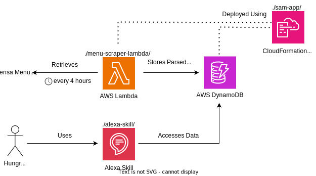

# RWTH Mensa Buttler: An unofficial Alexa skill for the canteens of RWTH Aachen University
Have you ever wanted to check the menu at the canteens of RWTH Aachen University without getting out of bed? 
Then this is the solution for you!

**RWTH Mensa Buttler is an Amazon Alexa Skill that provides you with the menu of all cafeterias of RWTH Aachen University.**
> [!WARNING]
> I created this skill for my personal use and education as a hobby side-project. I'm not taking any responsibility for the correctness of the data provided by this skill.
> This software is also in no way affiliated with the Studierendenwerk Aachen, the operator of the canteens of RWTH Aachen University.
> While the Studierendenwerk Aachen graciously granted me permission to automatically crawl their website for the menu data,
> they are not responsible for this software.
> The Studierendenwerk Aachen does not endorse this software and is not responsible for any issues that may arise from its use.
> Menu data provided by this skill may be incorrect, incomplete, or out of date.
> The Studierendenwerk Aachen will not answer any queries regarding this software.

## :rocket: Sounds great! How do I use it?
The skill is publicly available on the Alexa Skill Store. To use it, simply go to [this](https://www.amazon.de/dp/B0DB4H9VQZ/) link, and enable the skill.
Then use any of the features described below on your Alexa-enabled device or phone.

## :dart: Features
- [X] Architecture diagram SVG supports automated color-inversion for dark mode users
- [X] Multi-Language Support ( :uk:, :de: )
- [X] Get the menu for any mensa of RWTH Aachen University for specific days, including past days

> User:&nbsp;Alexa, ask RWTH mensa what's on the menu at mensa vita next Monday
>
> Alexa:&nbsp; The vegetarian dish has cauliflower nuggets with aioli. The classical dish (...). As a side dish, you can choose from: (...). Additionally, there are 4 other dishes to choose from: (...).

- [X] Get probable reasons for data being unavailable
> User:&nbsp;Alexa, ask RWTH mensa what's on the menu at mensa academica on 2024-05-30
>
> Alexa:&nbsp;I'm sorry, I don't have any menu data for mensa academica at 2024-05-30. But this is not surprising as 2024-05-30 is a public holiday in North Rhine-Westphalia.

- [X] Get all vegetarian or vegan dishes for a specific day
> User:&nbsp;Alexa, ask RWTH mensa what vegetarian dishes are offered at mensa ahornstraße next Thursday
>
> Alexa:&nbsp;There are 2 vegetarian dishes to choose from at mensa ahornstraße: The vegetarian table dish has (...). The vegetarian dish has (...).

- [X] Inquire about specific dish types (Supported: Classical dish, Table dish, Pizza, Burger, Wok, Pasta)
> User:&nbsp;Alexa, ask RWTH mensa what burgers are offered at mensa academica next Thursday
>
> Alexa:&nbsp;There are 3 burger to choose from at mensa Academica: The classical burger is (...).

- [ ] Get a list of all mensas (`Which mensas are there?`)
- [ ] (Maybe) Get prices for specific dishes (`How much does the pizza at mensa academica cost?`)
- [ ] (Maybe) Get the opening hours of a mensa (`When does mensa academica close today?`)
- [ ] (Maybe) Integrate other ways to access the data in addition to the Alexa voice interface
  - [ ] (Maybe) a RESTfull API
  - [ ] (Maybe) an RSS Feed
  - [ ] (Maybe) a WhatsApp/Discord/Matrix/Telegram bot

## :gear: Architecture
The entire skill is hosted on AWS. All parts of the skill are serverless and their source code is contained in this repository. This way I do not need to pay anything to maintain this skill.
The following diagram shows the architecture of the skill:

*FYI: I injected some fancy CSS into the SVG generated by draw.io to ensure that it looks good in dark mode and light mode. What a time to be alive!*

### Project Components
Most project components are decently documented. Feel free to check them out.

| Folder                                             | Content                                                                                                                                                     |
|----------------------------------------------------|-------------------------------------------------------------------------------------------------------------------------------------------------------------|
| [Alexa Skil](./alexa-skill/)                       | Alexa Skill and Invocation Models                                                                                                                           |
| [Alexa Skill Lambda](./alexa-skill/lambda-pdm)     | AWS Lambda function for the Skill                                                                                                                           |
| [Alexa Skill Package](./alexa-skill/skill-package) | MetaData required for the skill to function                                                                                                                 |
| [Menu Scrapper Lambda](./menu-scrapper-lambda)     | AWS Lambda function for scrapping the menu information from the websites                                                                                    |
| [Menu Scrapper Lib](./menu-scrapper-lib)           | Go Library for scrapping the menu information. Used by Menu Scrapper Lambda                                                                                 |
| [SAMA App](./sam-app)                              | AWS SAM (Servless Application Model) App. Defines Infrastructure as Code for everything except the Alexa Skill (e.g., Scrapper Lambda, DynamoDB tables, ... |

### Design decisions
**Q:** Why does the skill lambda directly access the database instead of using an API Gateway?

**A:** Amazon does not charge for invocations of the skill lambda. 
However, they do charge for invocations of any other lambda or usage of an API Gateway (beyond the 12-month free tier).
I want to avoid any case where a user-made request would result in a charge for me as this could easily be abused by a malicious user.
Accessing the database directly does not incur any cost as the always-free tier of AWS includes sufficient reserved capacity units for this skill.

**Q:** Why are the different components of the skill written in different languages?

**A:** The scrapper is written in go primarily because I want to learn go.
At the time of creation, amazon does not support the creation of Alexa-hosted skills in go. Therefore, I went with python for the skill lambda.

**Q:** Why is there no CD pipeline for the skill?

**A**: As this repository is public, all GitHub Actions log files are public as well. Considering that even just the name of a private S3 bucket can be used to cause expenses (see https://medium.com/@maciej.pocwierz/how-an-empty-s3-bucket-can-make-your-aws-bill-explode-934a383cb8b1) I do not feel comfortable running a public CD pipeline for this skill.
